# FSD - Salesforce CPQ <> SAP VCP Integration

## Table of Contents
- [1. Document Control](#1-document-control)
- [2. Objectives](#2-objectives)
- [3. In Scope](#3-in-scope)
- [4. Out of Scope](#4-out-of-scope)
- [5. Baseline Setup Already Implemented (Copied from salesforce_config.md)](#5-baseline-setup-already-implemented-copied-from-salesforce_configmd)
  - [5.1 Salesforce Named Credentials - Configuration](#51-salesforce-named-credentials---configuration)
  - [5.2 CPQ External Plugin Configuration](#52-cpq-external-plugin-configuration)
    - [External Configurator Page setup](#external-configurator-page-setup)
    - [Add External configurator url page in CPQ](#add-external-configurator-url-page-in-cpq)
    - [Recreate PoC](#recreate-poc)
    - [Current Runtime UI (LWC) - authoritative path](#current-runtime-ui-lwc---authoritative-path)
    - [LWC full implementation demo (step-by-step)](#lwc-full-implementation-demo-step-by-step)
- [6. Current Functional Behavior (As-Is)](#6-current-functional-behavior-as-is)
  - [6.0 Runtime architecture clarification](#60-runtime-architecture-clarification)
  - [6.1 High-Level Flow](#61-high-level-flow)
  - [6.2 UI and runtime highlights](#62-ui-and-runtime-highlights)
- [7. Product Configuration Callouts (Implemented)](#7-product-configuration-callouts-implemented)
  - [7.1 Endpoints currently used by LWC/Apex facade](#71-endpoints-currently-used-by-lwcapex-facade)
  - [7.2 Callout ownership](#72-callout-ownership)
- [8. ETag Strategy (Critical Point)](#8-etag-strategy-critical-point)
  - [8.1 Current algorithm](#81-current-algorithm)
  - [8.2 Risks](#82-risks)
  - [8.3 Mitigations proposed](#83-mitigations-proposed)
- [9. Salesforce Persistence Model for VCP Data](#9-salesforce-persistence-model-for-vcp-data)
  - [9.1 Current persisted data (as-is)](#91-current-persisted-data-as-is)
  - [9.2 Recommended target data model](#92-recommended-target-data-model)
  - [9.3 Data retention proposal](#93-data-retention-proposal)
  - [9.4 Field mapping (Testing Adesso VC SAP)](#94-field-mapping-testing-adesso-vc-sap)
  - [9.5 Technical assumptions and storage requirements](#95-technical-assumptions-and-storage-requirements)
  - [9.6 Consolidated mapping matrix (SAP to Salesforce)](#96-consolidated-mapping-matrix-sap-to-salesforce)
- [10. Pricing Integration Roadmap](#10-pricing-integration-roadmap)
  - [10.1 Pricing endpoints already available in Apex](#101-pricing-endpoints-already-available-in-apex)
  - [10.2 Planned functional sequence](#102-planned-functional-sequence)
  - [10.3 Critical dependencies for pricing phase](#103-critical-dependencies-for-pricing-phase)
- [11. Critical Points and Controls](#11-critical-points-and-controls)
  - [11.1 Concurrency and state](#111-concurrency-and-state)
  - [11.2 Translation and grouping consistency](#112-translation-and-grouping-consistency)
  - [11.3 Non-configurable subitem behavior](#113-non-configurable-subitem-behavior)
  - [11.4 Stored Config ID semantics](#114-stored-config-id-semantics)
  - [11.5 Error handling strategy (current implementation)](#115-error-handling-strategy-current-implementation)
- [12. Refactor Plan (Next Step)](#12-refactor-plan-next-step)
- [13. Open Decisions](#13-open-decisions)
- [14. Acceptance Criteria for This FSD](#14-acceptance-criteria-for-this-fsd)

## 1. Document Control
- Document: FSD_SF_VCP_integration
- Scope: Salesforce CPQ external configurator integration with SAP Variant Configuration and SAP Pricing services
- Status: Draft for implementation hardening and refactor planning
- Last update: 2026-04-17

## 2. Objectives
- Define end-to-end functional and technical behavior already implemented for SAP Product Configuration (VCP).
- Define Salesforce persistence strategy for VCP data (current + target).
- Highlight critical technical points (especially ETag handling and concurrency).
- List current callouts in Product Configuration and planned callouts in Pricing.
- Provide a phased plan for cleanup/refactor without breaking working behavior.

## 3. In Scope
- LWC flow: product selection -> configuration load/create -> characteristic editing -> patch/reset.
- Salesforce persistence for configuration session linkage.
- SAP VCP callout contract (v2) and pricing callout roadmap (v1).
- UX and data consistency across language switching and subitem handling.

## 4. Out of Scope
- Final CPQ quote calculation strategy and full pricing orchestration into quote lines.
- Security hardening details (field-level permissions matrix, event monitoring retention, SIEM integration).
- Performance tests at production scale.

## 5. Baseline Setup Already Implemented (Copied from salesforce_config.md)

### 5.1 Salesforce Named Credentials - Configuration
Two named credentials, same behavior as in the PoC.

#### Product Configuration
- External Credential: SAP_BTP_Product_Configuration
  - Name: SAP_BTP_Product_Configuration
  - Label: SAP BTP Product Configuration
  - Auth protocol: OAuth 2.0
  - Auth Flow Type: Client Credentials with Client Secret flow
  - Scope: empty
  - Identity Provider URL: https://bbm-entitlements-d.authentication.eu10.hana.ondemand.com/oauth/token
  - Pass client credentials in request body: true
  - Principals
    - grant_type=client_credentials
    - Client Id: ****
    - Client secret: ****
- Named credential: SAP_VC_Product_Configuration
  - Label: SAP VC Product Configuration
  - Name: SAP_VC_Product_Configuration
  - URL: https://cpservices-product-configuration.cfapps.eu10.hana.ondemand.com
  - Enabled for callouts: true
  - Authentication
    - External Credential: SAP_BTP_Product_Configuration
  - Generate auth header: true

#### Pricing Configuration (TODO)
- External Credential: SAP_BTP_Pricing
  - Name: SAP_BTP_Pricing
  - Label: SAP BTP Pricing
  - Auth protocol: OAuth 2.0
  - Auth Flow Type: Client Credentials with Client Secret flow
  - Scope: empty
  - Identity Provider URL: (TODO)
  - Pass client credentials in request body: true
  - Principals
    - grant_type=client_credentials
    - Client Id: ****
    - Client secret: ****
- Named credential: SAP_VC_Pricing
  - Label: SAP VC Pricing
  - Name: SAP_VC_Pricing
  - URL: (TODO)
  - Enabled for callouts: true
  - Authentication
    - External Credential: SAP_BTP_Pricing
  - Generate auth header: true

### 5.2 CPQ External Plugin Configuration

Note on implementation status:
- Visualforce assets are retained as historical PoC/reference.
- Active runtime implementation for end users is now LWC-based (Quick Action on Quote).

#### External Configurator Page setup
- External Configurator Page: deploy `CPQExternalConfigurator.page` (currently in progress), used to facilitate communication between Salesforce CPQ and SAP VCP.
- This page is included in the CPQ settings step to define External Configurator URL.
- Salesforce documentation reference:
  - Salesforce Help: Configure Salesforce CPQ to Use the External Configurator.

#### Add External configurator url page in CPQ

1. Process
   1. From Setup, in the Quick Find box, Installed Packages, and then select **Installed Packages**.
   2. Find the Salesforce CPQ package and click **Configure**.
   3. Select the **Additional Settings** tab.
   4. In the External Configurator URL field, enter the URL for your external configurator.
   5. To get the URL of a Visualforce page, click preview. You can use either an absolute or a relative URL. To use the custom configurator with Experience Cloud, you must use a relative URL, because the URL format of Salesforce Lightning and externally-hosted web applications are different.
   6. Optional: On the Additional Settings page, you can also select the **Third Party Configurator** field. When active, Salesforce CPQ launches the external configurator so it takes up your entire screen. Any action that closes the external configurator, such as clicking cancel or save, redirects to the page that launched the external configurator.
   7. Find the products to configure with the external configurator.
      1. Select the **Externally Configurable** field on each product record.
      2. Make sure each product's **Configuration Type** field is set to Required.
      3. The external configurator launches when a user clicks the wrench next to a configurable bundle, or when the user adds a product where a configuration event is required. If you set the configuration type to Allowed, the external configurator launches only when a sales rep selects the wrench icon next to a configurable bundle.

2. Setting Products available for external configuration
   1. Product metadata requirements for test and rollout products:
      - `SBQQ__ExternallyConfigurable__c` = checked
      - `SBQQ__ConfigurationType__c` = `Required`
      - `SBQQ__ConfigurationEvent__c` = `Always`

#### Screenshot reference (CPQ settings)
- See attached screenshot for:
  - Salesforce CPQ Configure page
  - Additional Settings tab
  - External Configurator URL field location

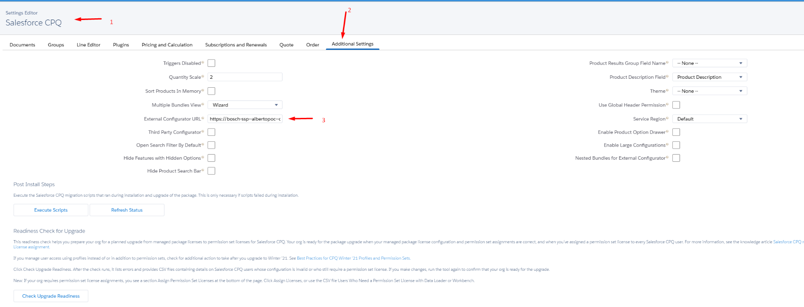

#### Recreate PoC
- Apex class: CPQExternalConfiguratorControllerPoC
- Visualforce page: CPQExternalConfiguratorTabs.page
- Settings Editor
  - Salesforce CPQ: https://bosch-ssp--albertopoc--c.sandbox.vf.force.com/apex/CPQExternalConfiguratorTabs
- Product for testing
  - Product code: F-00K-115-059
  - SBQQ__ExternallyConfigurable__c: true
  - SBQQ__ConfigurationType__c = Required
  - SBQQ__ConfigurationEvent__c = Always

Recreate PoC execution flow (documented with screenshots):
1. Open a Quote record prepared for CPQ product configuration.
2. Click **Edit Lines** to enter CPQ Quote Line Editor.
3. In the line editor, trigger the external configuration action (wrench/configure) for the externally configurable bundle.
4. CPQ opens the Visualforce PoC page (`CPQExternalConfiguratorTabs.page`), where UI rendering and SAP VCP callouts are executed.

Screenshots (step-by-step evidence):
- Step 1 - Quote entry point:

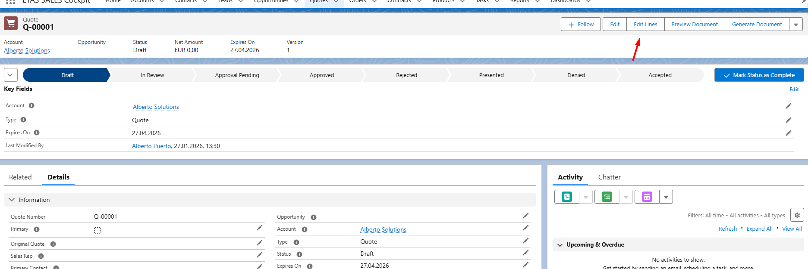

- Step 2 - CPQ Edit Lines access:

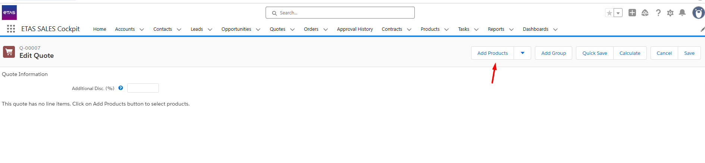

- Step 3 - Configure action in CPQ line editor:

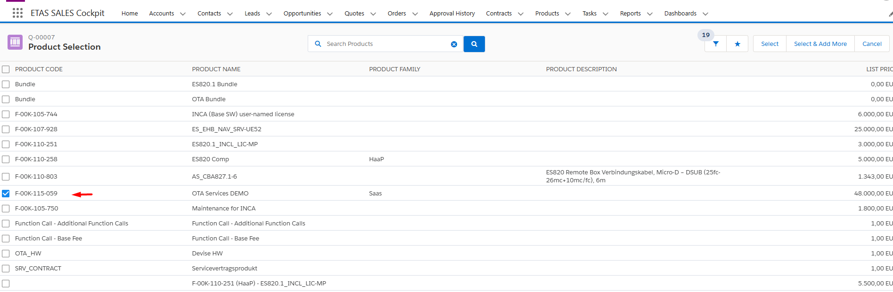

- Step 4 - Visualforce PoC page opened (UI + VCP callouts):

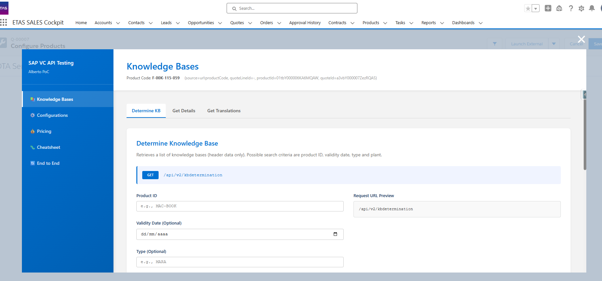

- Step 5 - SAP VCP callouts executed successfully in Adesso environment:

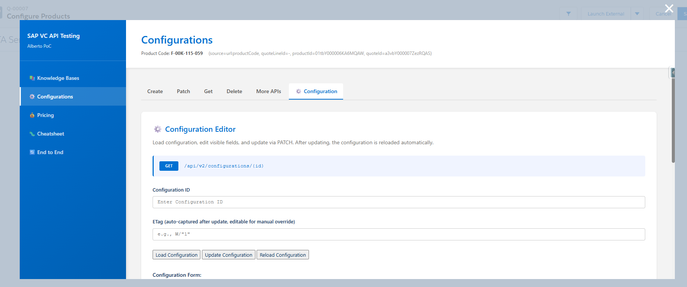

- Step 6 - Validation result and pending scope:
  - All Product Configuration callouts worked correctly against Adesso SAP VCP environment.
  - Due to Bosch SCP dependencies, Pricing Domain testing is still pending because that domain is not ready on their side yet.

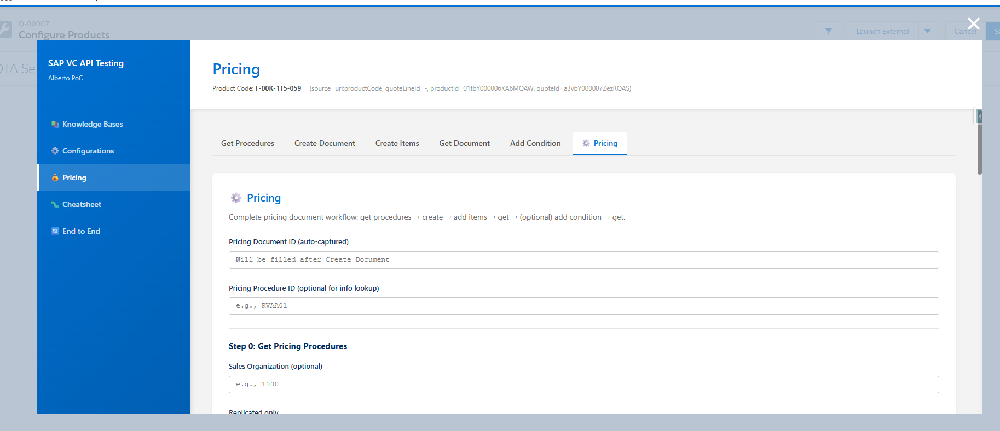

- Step 7 - End-to-end implementation decision and migration path:
  - End-to-end flow implementation was also started in this PoC area.
  - For scalability and code clarity, implementation was migrated to LWC.
  - A Quote Quick Action was created to recreate product-selection entry behavior and route users into the new LWC components.

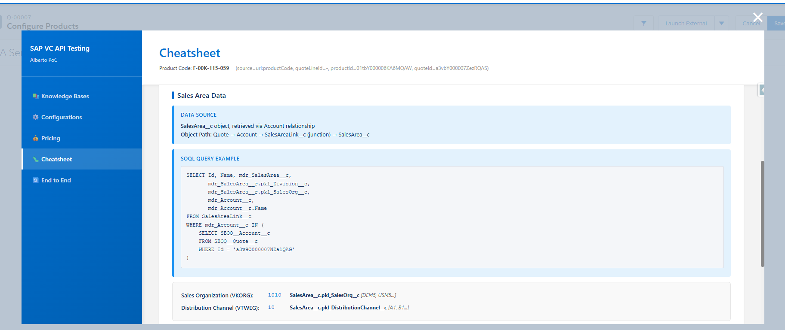

- Step 8 - Example of End-to-End section in Visualforce (before migration to LWC):

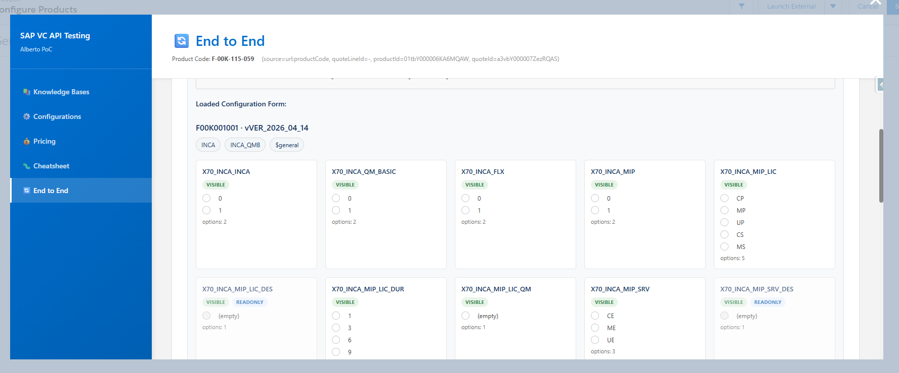

#### Full implementation for CPQ External Configurator pattern
- Apex class: CPQExternalConfiguratorController
- Apex: additional classes
- Visualforce page: VC_SAP_CPQ_Configurator_PoC.page (legacy/reference)
- Runtime UI entrypoint (current): Quote Quick Action -> LWC flow

#### Current Runtime UI (LWC) - authoritative path
- Entry point: Quick Action on Quote (Add Product / VCP action).
- First screen component: `vcpProductSelector`
  - Replicates CPQ Add Product search behavior (family filter, externally configurable filter, sorting, row select, continue action).
- Second screen component: `vcpConfigManager`
  - Creates/loads SAP configuration, renders root/subitems, handles tabs/fields, patch/reset, translations, and activity log.
- Child components currently used:
  - `vcpCharacteristicsGroupTabs`
  - `vcpCharacteristicsForm`

#### LWC full implementation demo (step-by-step)

1. Quote entrypoint with Quick Action
  - User starts from Quote and clicks **VCP Add Product** Quick Action.
  - This is the new LWC entrypoint replacing legacy PoC navigation for daily usage.

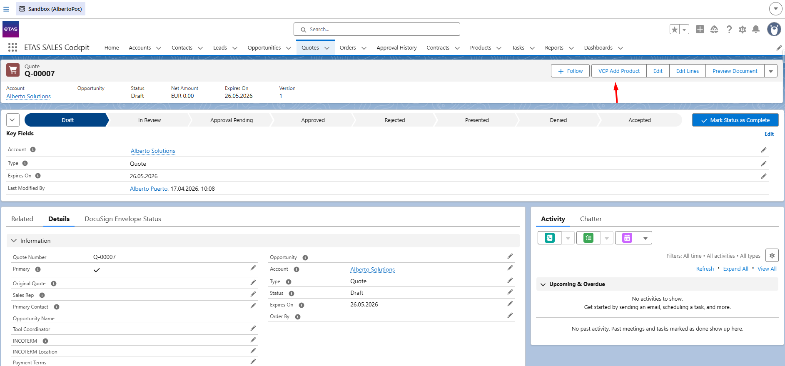

2. Product selection screen (`vcpProductSelector`)
  - Quick Action opens product selector modal.
  - User can filter by **Product Family** and by **Externally Configurable only** to accelerate product search.

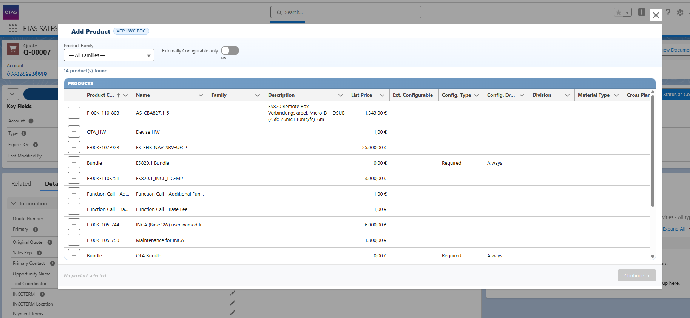

3. Filter usage, product selection, and redirect trigger
  - Demo shows family-filter usage and selection of an externally configurable product.
  - Clicking **Continue** redirects to configuration component (`vcpConfigManager`).

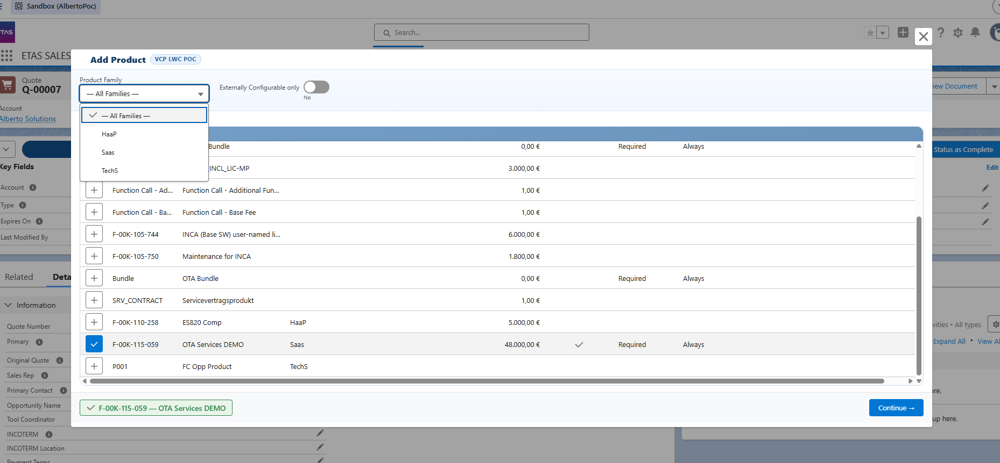

4. Configuration manager opened (`vcpConfigManager`) - demo phase
  - On open, system checks Salesforce storage and retrieves existing Quote `configId` when available.
  - This retrieval is currently in demo mode and can be fully automated later based on implementation requirements.
  - In Step 1 (**Create Configuration**) we can visualize:
    - `kbId` to be used for creation.
    - `productKey` sent to SAP.
  - For this demo, `productKey` was adjusted ad hoc to align with the product available in SAP VCP database; default behavior uses the selected product `productName` from previous step.

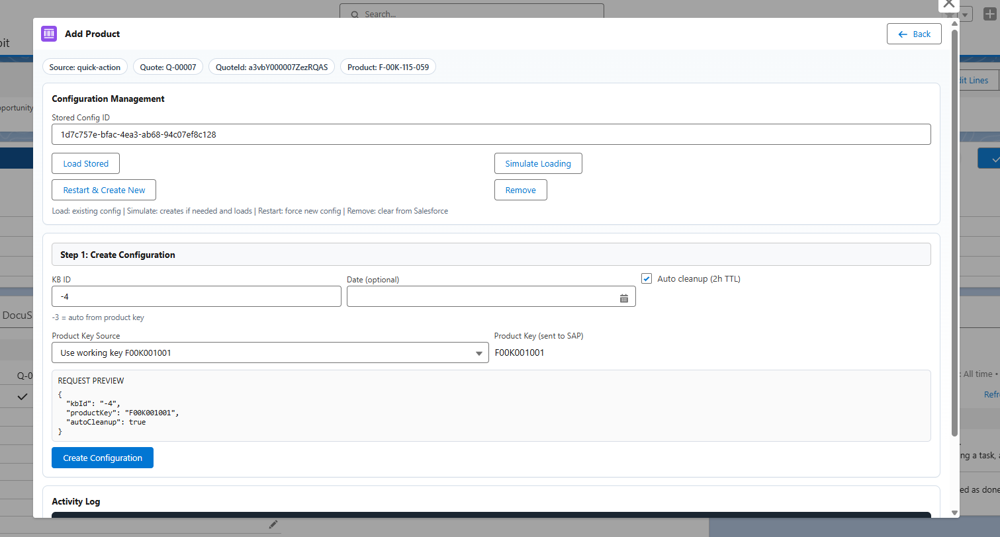

5. Configuration creation in SAP VCP + persistence/read in Salesforce
  - Create Configuration is executed against SAP VCP.
  - Returned `configId` is persisted on Quote in Salesforce and reused for subsequent read/load.
  - Initial read includes translations call in **English** by default.

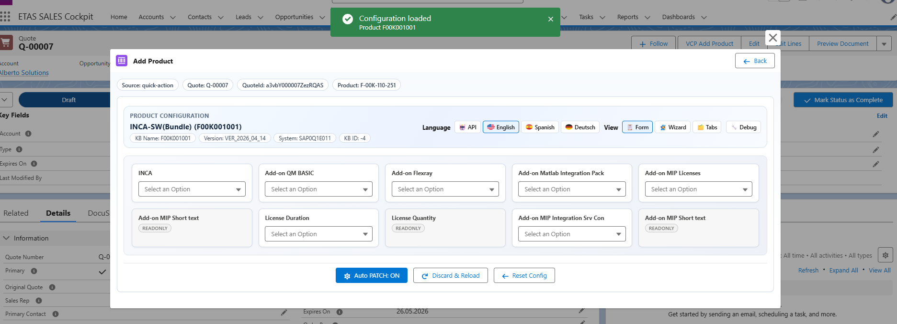

6. Form rendering baseline (v1)
  - First implementation renders fields in a flat form-oriented way (without final grouping order).
  - This view is still available as compatibility mode during implementation.

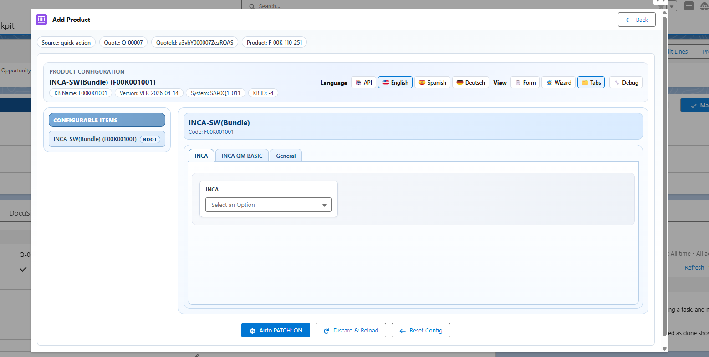

7. Tabs mode (target UX) with grouped characteristics
  - Target implementation uses **Tabs** view to organize characteristics by `characteristicGroups`.
  - To build these tabs, an additional prior call is performed to retrieve grouping metadata and cross-map it with configuration characteristics.

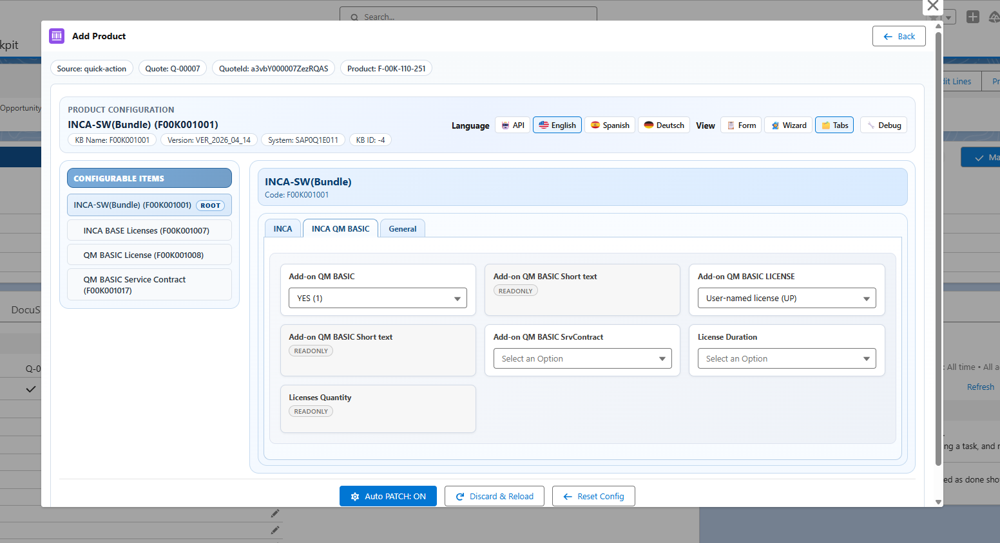

8. Live editing with automatic PATCH and ETag recalculation
  - Field edits generate PATCH operations automatically when Auto PATCH is enabled.
  - After each successful PATCH, latest ETag is recalculated/updated for next `If-Match` operation.

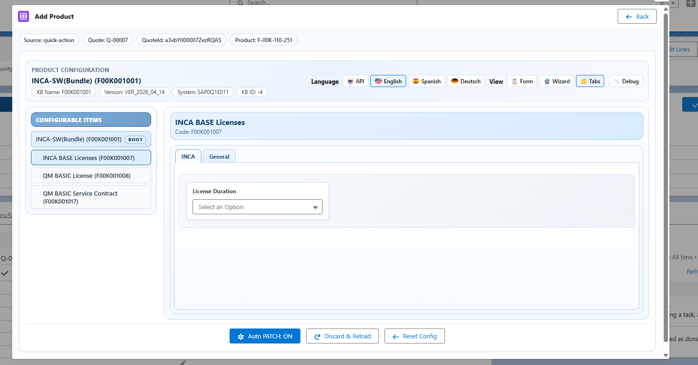

9. Auto PATCH OFF for grouped/manual submission
  - Auto PATCH can be disabled to accumulate multiple field changes.
  - User can then send one consolidated PATCH request (manual send pending).

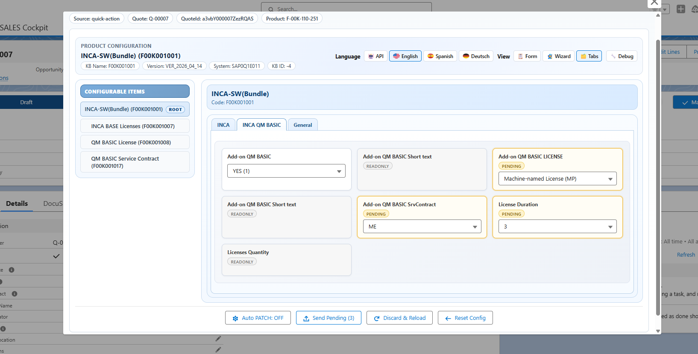

10. Debug mode entry point and controlled visibility
  - Debug mode is available for advanced diagnostics.
  - Access can be restricted via permissions/profile strategy if required in productive rollout.

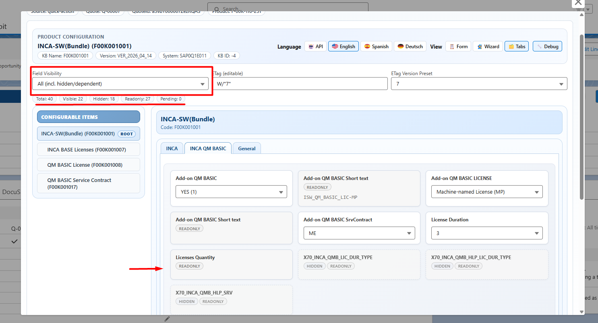

11. Debug mode detail: hidden/read-only diagnostics
  - In debug context, hidden/read-only field behavior can be inspected to validate dependency rules and rendering decisions.

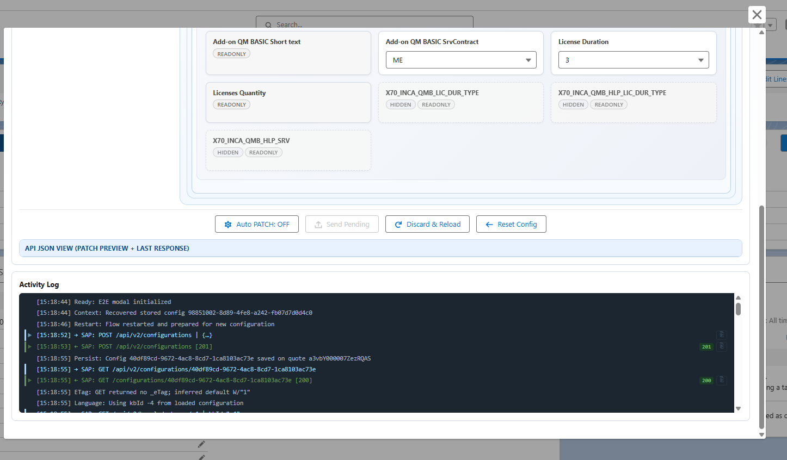

12. API JSON view + Activity Log traceability
  - API JSON panel can be expanded to inspect live PATCH payload build-up and last SAP response.
  - Activity Log supports expanded call traces:
    - Blue entries: outbound calls to SAP.
    - Green entries: SAP responses.
  - JSON payloads can be copied using the copy icon shown on the right side of each trace entry.

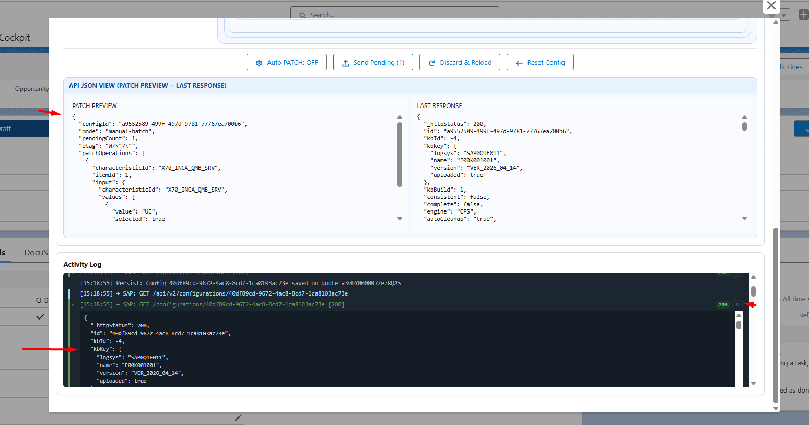


```mermaid
flowchart LR
  A[Quote Quick Action] --> B[vcpProductSelector]
  B -->|Continue with selected product| C[vcpConfigManager]
  C --> D[Characteristic Tabs and Fields]
  D --> E[SAP Product Configuration Callouts]
```

## 6. Current Functional Behavior (As-Is)

### 6.0 Runtime architecture clarification
- This FSD applies to the LWC runtime architecture (not the Visualforce PoC runtime).
- Visualforce endpoints remain documented only as baseline/history and fallback reference.

### 6.1 High-Level Flow
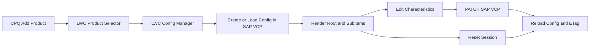
```mermaid
flowchart LR
  A[CPQ Add Product] --> B[LWC Product Selector]
  B --> C[LWC Config Manager]
  C --> D[Create or Load Config in SAP VCP]
  D --> E[Render Root and Subitems]
  E --> F[Edit Characteristics]
  F --> G[PATCH SAP VCP]
  G --> H[Reload Config and ETag]
  E --> I[Reset Session]
  I --> H
```

### 6.2 UI and runtime highlights
- Product tree includes root and subitems.
- Subitems marked as non-configurable are visually differentiated and rendered as readonly.
- Default language mode is English on configuration load.
- Tabs/grouping are driven primarily from knowledge base groups (`/knowledgebases/{kbId}`), with fallbacks.

## 7. Product Configuration Callouts (Implemented)

### 7.1 Endpoints currently used by LWC/Apex facade
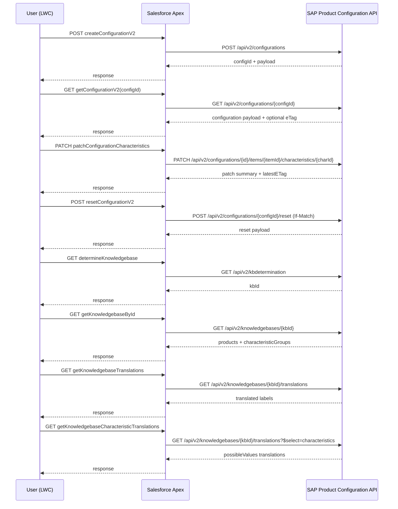
```mermaid
sequenceDiagram
  participant U as User (LWC)
  participant SF as Salesforce Apex
  participant SAP as SAP Product Configuration API

  U->>SF: POST createConfigurationV2
  SF->>SAP: POST /api/v2/configurations
  SAP-->>SF: configId + payload
  SF-->>U: response

  U->>SF: GET getConfigurationV2(configId)
  SF->>SAP: GET /api/v2/configurations/{configId}
  SAP-->>SF: configuration payload + optional eTag
  SF-->>U: response

  U->>SF: PATCH patchConfigurationCharacteristics
  SF->>SAP: PATCH /api/v2/configurations/{id}/items/{itemId}/characteristics/{charId}
  SAP-->>SF: patch summary + latestETag
  SF-->>U: response

  U->>SF: POST resetConfigurationV2
  SF->>SAP: POST /api/v2/configurations/{configId}/reset (If-Match)
  SAP-->>SF: reset payload
  SF-->>U: response

  U->>SF: GET determineKnowledgebase
  SF->>SAP: GET /api/v2/kbdetermination
  SAP-->>SF: kbId
  SF-->>U: response

  U->>SF: GET getKnowledgebaseById
  SF->>SAP: GET /api/v2/knowledgebases/{kbId}
  SAP-->>SF: products + characteristicGroups
  SF-->>U: response

  U->>SF: GET getKnowledgebaseTranslations
  SF->>SAP: GET /api/v2/knowledgebases/{kbId}/translations
  SAP-->>SF: translated labels
  SF-->>U: response

  U->>SF: GET getKnowledgebaseCharacteristicTranslations
  SF->>SAP: GET /api/v2/knowledgebases/{kbId}/translations?$select=characteristics
  SAP-->>SF: possibleValues translations
  SF-->>U: response
```

### 7.2 Callout ownership
- LWC orchestrates runtime state and invokes Apex facade (`VcpConfigManagerController`).
- Apex facade delegates to `CPQExternalConfiguratorController` and service classes.

## 8. ETag Strategy (Critical Point)

### 8.1 Current algorithm
1. On GET configuration:
   - If payload has `_eTag` or `etag`, use it.
   - Else reuse `lastKnownETag`.
   - Else infer weak default `W/"1"`.
2. On PATCH success:
   - Prefer `latestETag` returned by patch summary.
   - Else search payload for any eTag key.
3. Before PATCH/RESET:
   - Use manual ETag if user entered one.
   - Else config payload eTag.
   - Else `lastKnownETag`.
   - Else version-derived weak ETag.
   - Else fallback `W/"1"`.

### 8.2 Risks
- If backend concurrency version drifts and no reliable eTag is returned, fallback `W/"1"` may be stale.
- Generic key search for `etag` could accidentally capture a non-concurrency field in malformed payloads.

### 8.3 Mitigations proposed
- Require explicit eTag from backend on GET and PATCH in contract tests.
- Add warning telemetry whenever fallback `W/"1"` is used.
- Add retry policy for HTTP 412/428 with immediate reload and user hint.

## 9. Salesforce Persistence Model for VCP Data

### 9.1 Current persisted data (as-is)
- Quote-level persisted config pointer via `saveConfigIdToQuote/getConfigIdFromQuote/clearConfigIdFromQuote`.
- Behavior implication: switching product inside same quote can keep same stored config pointer.

### 9.2 Recommended target data model

#### Option A: Minimal (fast to implement)
- Keep one quote-level active config id.
- Add audit fields on Quote:
  - Last sync timestamp
  - Last known ETag
  - Last SAP kbId

#### Option B: Robust (recommended)
Create custom object `VCP_Session__c`:
- `Quote__c` (Lookup)
- `QuoteLine__c` (Lookup, optional)
- `Product2__c` (Lookup)
- `ProductCode__c` (Text)
- `SAP_ConfigId__c` (Text 36)
- `SAP_KbId__c` (Number/Text)
- `SAP_KbName__c` (Text)
- `SAP_KbVersion__c` (Text)
- `LastKnownETag__c` (Text)
- `Language__c` (Picklist)
- `IsActive__c` (Checkbox)
- `LastSyncAt__c` (Datetime)
- `Status__c` (Picklist: Open, Completed, Reset, Error)
- `ErrorCorrelationId__c` (Text)
- `ErrorMessage__c` (Long Text)

Create child object `VCP_ChangeLog__c`:
- `VCP_Session__c` (Master-Detail)
- `CharacteristicId__c` (Text)
- `OldValue__c` (Long Text)
- `NewValue__c` (Long Text)
- `OperationType__c` (Picklist: PATCH, RESET, CREATE)
- `OperationAt__c` (Datetime)
- `Result__c` (Picklist: Success, Error)
- `HttpStatus__c` (Number)

### 9.3 Data retention proposal
- Keep active sessions: indefinite while quote open.
- Archive changelog after quote finalization + X months.
- Purge stale sessions not synced for N days (batch job).

### 9.4 Field mapping (Testing Adesso VC SAP)

#### Main data
- Material:
  - Example value: `MAC-BOOK`
  - Salesforce mapping: `Product2.ProductCode` (format `F-00X-...`)
- Pricing Procedure ID:
  - Example value: `A10002`
  - Source strategy: query pricing procedures and filter by `replicated=true`, `documentCode`, and additional business filters to get `pricingProcedureId`.

#### Sales area data
- Data source:
  - `SalesArea__c` model retrieved through Account relationship.
  - Object path: `Quote -> Account -> SalesAreaLink__c (junction) -> SalesArea__c`.

SOQL example used for sales area resolution:

```sql
SELECT Id, Name, mdr_SalesArea__c,
       mdr_SalesArea__r.pkl_Division__c,
       mdr_SalesArea__r.pkl_SalesOrg__c,
       mdr_Account__c,
       mdr_Account__r.Name
FROM SalesAreaLink__c
WHERE mdr_Account__c IN (
    SELECT SBQQ__Account__c
    FROM SBQQ__Quote__c
    WHERE Id = :quoteId
)
```

- Sales Organization (VKORG):
  - Example resolved value: `1010`
  - Salesforce source field: `SalesArea__c.pkl_SalesOrg__c` (examples: `DEM5`, `USM5`)
- Distribution Channel (VTWEG):
  - Example resolved value: `10`
  - Salesforce source field: `SalesArea__c.pkl_DistributionChannel__c` (examples: `A1`, `B1`)

### 9.5 Technical assumptions and storage requirements

#### Configuration ID storage
- `configurationId` must be stored in `SBQQ__Quote__c.SAP_VCP_Config_ID__c`.
- This id is required to retrieve/update/reset/delete configuration state with SAP VC APIs.
- Current flow already persists it after create in End-to-End via `saveConfigIdToQuote`.

#### Pricing document ID storage (TTL-sensitive)
- `documentId` (UUID) must be stored after pricing document creation.
- Critical behavior: SAP pricing documents have TTL and can expire after inactivity.
- If response is HTTP `404 documentId not found`, treat the document as expired and create a new pricing document.
- Recommendation:
  - Store in `SBQQ__Quote__c.SAP_Pricing_Doc_ID__c`.
  - Persist creation timestamp (for expiration checks and proactive renewal logic).

#### ETag storage for configuration updates
- ETag from create/patch responses must be stored and kept current.
- GET configuration may not return a reliable ETag for update concurrency in all scenarios.
- PATCH/RESET operations require `If-Match` with last known valid ETag.
- Recommendation: store latest configuration ETag in `SBQQ__Quote__c.SAP_Config_ETag__c` (Text 255).

#### If-Match handling for pricing operations
- Pricing operations are sequential and must propagate latest ETag:
  - Create Document -> returns ETag (example: `W/"1"`)
  - Create Items -> requires previous ETag in `If-Match`, returns new ETag
  - Add Conditions -> requires previous ETag in `If-Match`, returns new ETag
- Recommendation: store latest pricing ETag in `SBQQ__Quote__c.SAP_Pricing_ETag__c` and update it after every successful operation.

#### Alignment note with target model
- As-is behavior is quote-level pointer storage.
- Robust target model (`VCP_Session__c` + `VCP_ChangeLog__c`) should still mirror key quote-level identifiers for interoperability with CPQ process steps.

### 9.6 Consolidated mapping matrix (SAP to Salesforce)

| SAP / Integration Data | Example | Salesforce Source | Salesforce Storage Target | Required | Notes |
|---|---|---|---|---|---|
| Material | `MAC-BOOK` | `Product2.ProductCode` | Runtime payload to SAP VCP; optionally persisted in `VCP_Session__c.ProductCode__c` | Yes | Expected format in this project: `F-00X-...`. |
| Product Id | `01t...` | Quote line selected product (`Product2.Id`) | `VCP_Session__c.Product2__c` | Yes (robust model) | Useful for traceability and re-open flows. |
| Configuration ID (`configurationId`) | `UUID` | SAP create/get response | `SBQQ__Quote__c.SAP_VCP_Config_ID__c` (+ mirror in `VCP_Session__c.SAP_ConfigId__c`) | Yes | Primary key to GET/PATCH/RESET in VCP. |
| Configuration ETag | `W/"3"` | SAP response headers/body (create/patch/get when available) | `SBQQ__Quote__c.SAP_Config_ETag__c` (+ mirror in `VCP_Session__c.LastKnownETag__c`) | Yes for updates | Mandatory for `If-Match` in PATCH/RESET concurrency. |
| Knowledge Base ID (`kbId`) | `123456` | `kbdetermination` or configuration payload | Quote extension field (optional) and/or `VCP_Session__c.SAP_KbId__c` | Recommended | Drives grouping/translations and reproducibility. |
| Knowledge Base Name/Version | `X / 2026.01` | `GET /knowledgebases/{kbId}` | `VCP_Session__c.SAP_KbName__c`, `VCP_Session__c.SAP_KbVersion__c` | Recommended | Auditability across catalog updates. |
| Pricing Procedure ID | `A10002` | Pricing customizing query with filters (`replicated`, `documentCode`, business criteria) | Runtime pricing request field; optional persist in quote/session extension field | Required for pricing phase | Validate derivation per sales area and document context. |
| Sales Organization (VKORG) | `1010` | `SalesArea__c.pkl_SalesOrg__c` via `Quote -> Account -> SalesAreaLink__c -> SalesArea__c` | Runtime request field; optional persist in session snapshot | Yes (pricing/context) | Example org codes in org may be `DEM5`, `USM5` mappings. |
| Distribution Channel (VTWEG) | `10` | `SalesArea__c.pkl_DistributionChannel__c` via sales area relationship | Runtime request field; optional persist in session snapshot | Yes (pricing/context) | Example values: `A1`, `B1` (mapped to SAP code set). |
| Pricing Document ID (`documentId`) | `UUID` | SAP pricing create document response | `SBQQ__Quote__c.SAP_Pricing_Doc_ID__c` | Yes in pricing flow | TTL-sensitive; recreate when expired (404). |
| Pricing ETag | `W/"1"` then incrementing | SAP pricing response headers from create-items-conditions chain | `SBQQ__Quote__c.SAP_Pricing_ETag__c` | Yes in pricing flow | Update after every successful pricing operation. |
| Quote / Account linkage | `a3v...` / `001...` | `SBQQ__Quote__c.Id`, `SBQQ__Quote__c.SBQQ__Account__c` | `VCP_Session__c.Quote__c` (+ optional quote line lookup) | Yes | Correlation key for support and reporting. |

Validation recommendation:
- Before UAT sign-off, execute one end-to-end trace and verify each row of this matrix with real payload evidence (Nebula logs + persisted Salesforce records).

## 10. Pricing Integration Roadmap

### 10.1 Pricing endpoints already available in Apex
- `POST /api/v1/pricing` (`callPricingService`)
- `POST /api/v1/pricing/documents` (`pricingCreateDocument`)
- `POST /api/v1/pricing/documents/{documentId}/items` (`pricingCreateItems`)
- `GET /api/v1/pricing/documents/{documentId}` (`pricingGetDocument`)
- `GET /api/v1/customizing/procedures` (`pricingGetProcedures`)
- `GET /api/v1/customizing/procedures/{pricingProcedureId}` (`pricingGetProcedure`)
- `POST /api/v1/pricing/documents/{documentId}/conditions` (`pricingAddHeaderCondition`)

### 10.2 Planned functional sequence
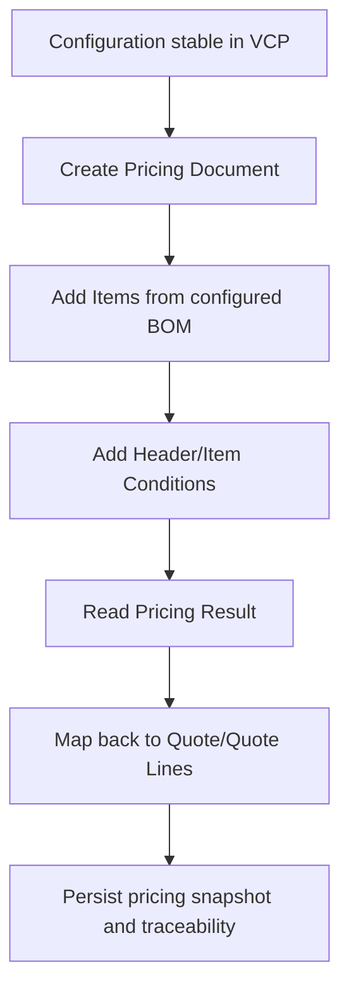
```mermaid
flowchart TD
  A[Configuration stable in VCP] --> B[Create Pricing Document]
  B --> C[Add Items from configured BOM]
  C --> D[Add Header/Item Conditions]
  D --> E[Read Pricing Result]
  E --> F[Map back to Quote/Quote Lines]
  F --> G[Persist pricing snapshot and traceability]
```

### 10.3 Critical dependencies for pricing phase
- Final credential values for `SAP_VC_Pricing`.
- Canonical mapping from VCP items/characteristics to pricing items.
- Currency, sales org, and procedure determination rules.

## 11. Critical Points and Controls

### 11.1 Concurrency and state
- ETag must be treated as mandatory for update operations.
- Avoid parallel write operations from multiple UI sessions on same config.

### 11.2 Translation and grouping consistency
- Group source priority should remain KB-by-id first, translation fallback second.
- Keep merged cache behavior to prevent tab collapse on language switches.

### 11.3 Non-configurable subitem behavior
- UI style and readonly rendering must be bound to `configurable=false` only.
- Hidden characteristics policy should be explicit per visibility mode.

### 11.4 Stored Config ID semantics
- Clarify business rule: one config per quote vs one config per quote+product/quoteLine.
- Current behavior aligns with one active pointer at quote level.

### 11.5 Error handling strategy (current implementation)

#### 11.5.1 Layers and responsibilities
- LWC layer (`vcpConfigManager`):
  - Logs request/response/error events in Activity Log.
  - Shows user-facing toast feedback (info/success/warning/error).
  - Extracts and surfaces correlation IDs when available.
- Apex facade (`VcpConfigManagerController`):
  - Validates inputs (for example, mandatory configId/configData).
  - Wraps unhandled exceptions and propagates user-safe messages.
- Integration/business layer (`CPQExternalConfiguratorController` + services):
  - Executes callouts.
  - Returns payload/status details needed for troubleshooting.

#### 11.5.2 Correlation ID pattern
- Errors returned from Apex can include an identifier in the format:
  - `VCP-YYYYMMDD-HHMMSS-XXXXXXXX`
- LWC extracts this ID and includes it in user messages and activity details.
- Operational requirement:
  - Support and logs must always allow searching by correlation ID.

#### 11.5.3 User-visible behavior by scenario
- Validation errors:
  - Immediate error toast with actionable text.
- SAP callout/runtime errors:
  - Sticky error toast.
  - Activity log entry with endpoint context and body excerpt.
- Configuration not found (HTTP 404 / non-existing):
  - Stored Config ID is cleared from Quote.
  - User receives explicit guidance to restart/create a new configuration.
- Translation endpoint failures (non-critical):
  - UI degrades to API labels or cached labels.
  - No hard stop for configurator flow.

#### 11.5.4 Recovery and fallback rules
- ETag failures (412/428 expected handling):
  - Reload configuration and refresh ETag before retrying PATCH/RESET.
- Missing eTag on GET:
  - Reuse `lastKnownETag` if available.
  - Otherwise fallback to weak `W/"1"` (with warning in logs).
- Missing translations:
  - Continue with API labels and preserve grouping cache when possible.

#### 11.5.5 Monitoring and control points
- Minimum telemetry fields for each failed operation:
  - Operation type (CREATE/GET/PATCH/RESET/TRANSLATIONS)
  - Endpoint path
  - HTTP status
  - Correlation ID
  - QuoteId, ProductCode, ConfigId (if available)
  - Timestamp and user context
- Recommended SLA controls:
  - Alert on repeated 5xx from SAP endpoints.
  - Alert on repeated fallback to inferred ETag (`W/"1"`).
  - Alert when 404 clear-config events exceed agreed threshold.

#### 11.5.6 Nebula Logger screenshots (operational evidence)
- Integration log overview (request/response and status timeline):

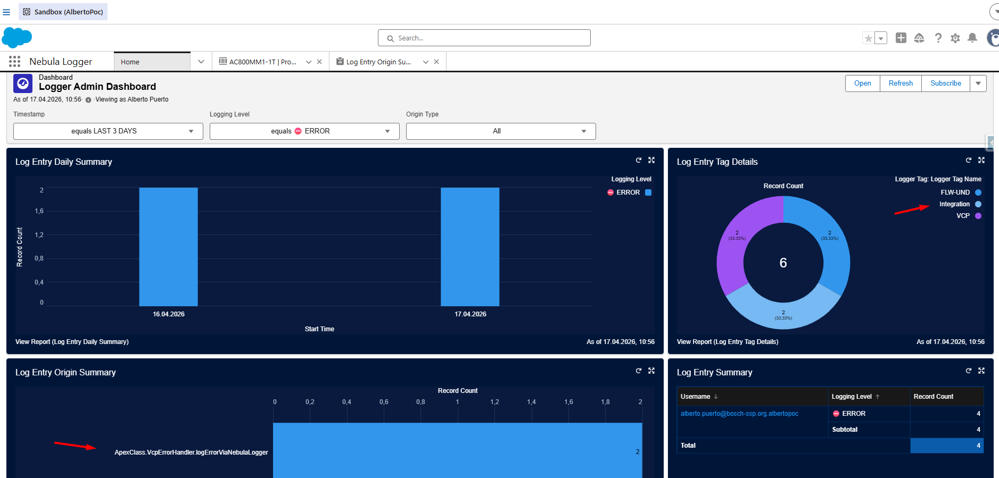

- Request payload trace sample:

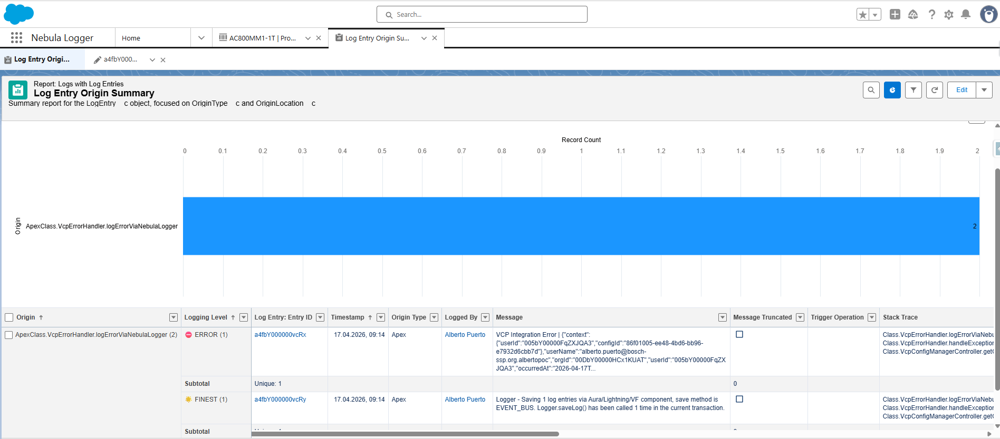

- Response/error trace sample with diagnostics:

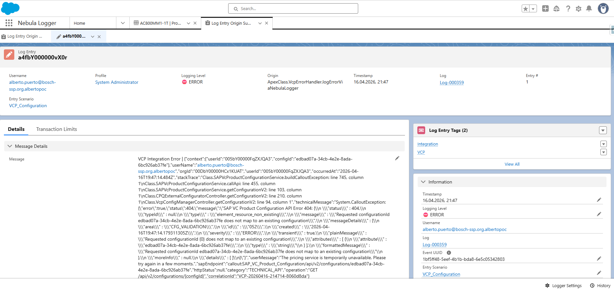

- Correlation and troubleshooting context sample:

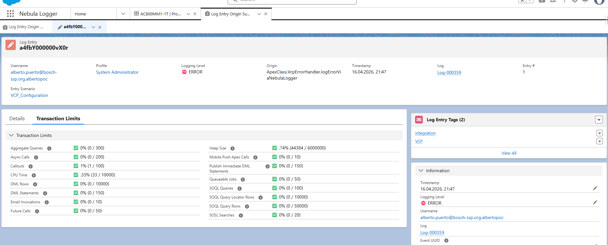

## 12. Refactor Plan (Next Step)

### Phase 1 - Stabilize contracts
- Freeze and document payload contracts for create/get/patch/reset.
- Add test fixtures for root item + non-configurable subitems.

### Phase 2 - Component decomposition
- Extract product tree into dedicated LWC (subitems navigation component).
- Keep tabs and characteristics as independent presentational components.
- Preserve state orchestration in parent container.

### Phase 3 - Persistence enhancement
- Implement `VCP_Session__c` and migration path from quote-level pointer.
- Add telemetry on ETag fallback and callout failures.

### Phase 4 - Pricing enablement
- Wire pricing flow after successful configuration checkpoint.
- Persist pricing document IDs and snapshots for audit.

## 13. Open Decisions
- Decide persistence granularity: quote-level vs quote-line/product-level sessions.
- Decide whether hidden-but-readonly characteristics should be auto-visible for non-configurable items.
- Decide final source of quote display number (CPQ quote number field standardization).

## 14. Acceptance Criteria for This FSD
- Product Configuration callouts and ETag policy are documented and approved.
- Salesforce persistence target model approved by CPQ + integration teams.
- Pricing roadmap approved with endpoint sequence and ownership.
- Refactor phases accepted for next implementation iteration.
